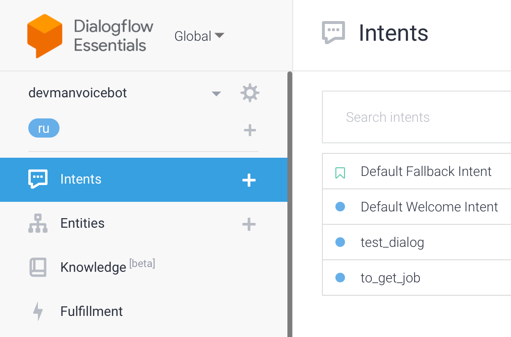
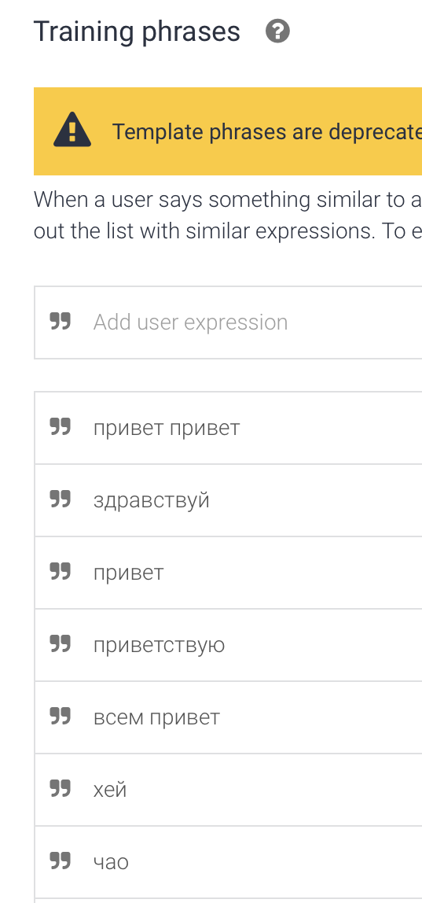
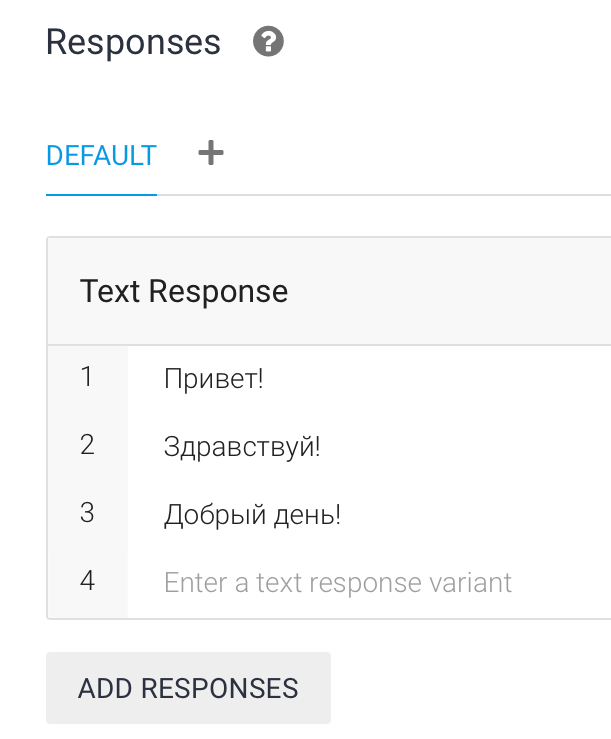

## Бот для Telegram и VK с интеграцией DialogFlow

Позволяет создавать чат боты со сценарием ответов.

<a href="https://imgbb.com/"></a>

### Как установить

#### Скачать 

Python3.11 должен быть уже установлен.
[Скачать](https://github.com/Araime/devman-bot/archive/master.zip) этот репозиторий себе на компьютер.

Рекомендуется использовать [virtualenv/venv](https://docs.python.org/3/library/venv.html)
для изоляции проекта.

#### Быстрая настройка venv

Начиная с Python версии 3.3 виртуальное окружение идёт в комплекте в виде модуля
venv. Чтобы его установить и активировать нужно выполнить следующие действия в
командной строке:  

Указать скачанный репозиторий в качестве каталога.
```sh
cd C:\Users\ваш_пользователь\Downloads\папка_репозитория
```
Установить виртуальное окружение в выбранном каталоге.
```sh
Python -m venv env
```
В репозитории появится папка виртуального окружения env  

<a href="https://imgbb.com/"></a>

Активировать виртуальное окружение.
```sh
env\scripts\activate
```
Если всё сделано правильно, вы увидите в командной строке (env) слева от пути 
каталога.  

<a href="https://imgbb.com/"></a>

#### Установить зависимости

Используйте `pip` (или `pip3`, есть конфликт с Python2) для установки 
зависимостей:

```sh
pip install -r requirements.txt
```

#### Переменные окружения

Создайте в корне репозитория файл `.env` и добавьте в него следующие строки:

```sh
TELEGRAM_TOKEN=токен_telegram_бота
TOKEN_VK=ваш_токен_vk_api
```

Создать бота для Telegram и узнать его токен можно у [Отца Ботов](https://telegram.me/BotFather).  
Токен vk можно получить на официальном сайте при создании группы [vk.com](https://vk.com/).

### Запуск

Найти вашего бота в Telegram и написать ему любое сообщение

Запуск скриптов выполняется командой:

```sh
python Telegram_bot.py
python VK_bot.py
```
### Тренировка бота

Для обучения бота новым сценариям, необходимо перейти на сайт [dialogflow](https://dialogflow.cloud.google.com/),
создать нового агента.
Во вкладке Intents появится возможность создавать сценарии диалогов.



